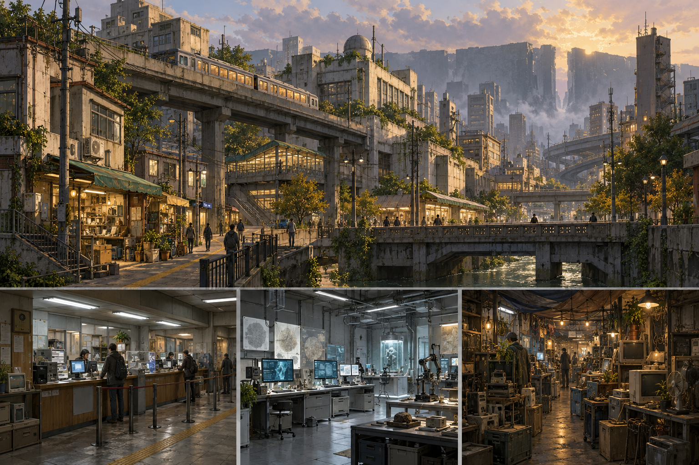

# Anomaly Dungeon 2D設定画ブレスト（Codex案）

**Status: Visual brainstorm（非正典の視覚案）**

## マップ別の画

| 対象 | 画像 | MD根拠 | 画として加えた仮案・採否の注意 |
| --- | --- | --- | --- |
| 8月31日 | [august-31-v1.png](august-31-v1.png) | [マップ案](../../../docs/systems/map-gimmick-ideas.md)、[景観構成](../../../docs/decisions/008-august-31-landscape-composition.md) | バス停から湖・集落・遠方の団地へ視線を通す。道路や建物が現実の日本の郊外に寄りすぎるため、架空都市としての意匠は再検討が必要。 |
| TSUTAYA | [tsutaya-v1.png](tsutaya-v1.png) | [マップ案](../../../docs/systems/map-gimmick-ideas.md)、[閉店直後のアーカイブ](../../../docs/decisions/009-tsutaya-closing-time-archive.md) | 明るい店頭、奥の暗い棚、CRT・試聴機・返却カートを試した。画像内の架空ジャケットや掲示の細部は設定ではない。ブランド表示は描かない。 |
| SEKIGAHARA | [sekigahara-v1.png](sekigahara-v1.png) | [マップ案](../../../docs/systems/map-gimmick-ideas.md) | 戦闘が遠景まで連続するスケールを試した。要塞・装備の時代感は未決定で、この絵の歴史風の服装や兵器を採用したわけではない。 |
| KOROHKAN | [korohkan-v1.png](korohkan-v1.png) | [マップ案](../../../docs/systems/map-gimmick-ideas.md) | 正面の門、外郭、高所、迂回路の同時視認を試した。中世要塞の見た目に寄ったため、世界の不均一な技術文明と合うか再検討が必要。 |
| Observation / Open Liminal Map | [open-liminal-v1.png](open-liminal-v1.png) | [マップ案](../../../docs/systems/map-gimmick-ideas.md)、[認知アノマリー](../../../docs/anomalies/cognitive-anomalies.md) | 広い草地と遠景の小施設に観察対象を置いた。建物・街灯・道・地形はいずれも仮案。最初の宗教施設風シルエットを、架空の小設備に修正した。 |

いずれもStudio実装を無視した2D設定画であり、マップの正確な地形、規模、ルート、NPC配置、発生アノマリーを確定しない。8月31日・TSUTAYAはプロトタイプがあるが、この画像を既存実装の外観とは扱わない。SEKIGAHARA・KOROHKAN・Open LiminalはIdea段階。

## Player Anomalyの知覚差

[Visible / Invisible Inversionの二画面案](player-anomaly-inversion-v1.png)は、[Player Anomalyの資料](../../../docs/anomalies/player-anomalies/visible-invisible-inversion.md)にある「同じ世界がプレイヤーの状態によって異なって認識される」を画にした仮案。左と右で同じ廊下を用い、右では通常の輪郭が不確かになり、別の情報が見える。金色の線は実際のInvisible Componentの形・分類を確定するものではなく、知覚差の可視化にすぎない。Player AnomalyはAnomaly Entityの新個体ではない。

## NPCの対比案

[博士と元同僚の二画面案](professor-colleague-v1.png)は、[whisperの元同僚Quest](../../../docs/anomalies/whisper.md)にある博士の確信と、制御・分析に疑問を持った元同僚の対立を、異なる研究環境と姿勢で試したもの。画像が生成した人物の顔立ち、性別、年齢、髪型、白衣、装置の形状、研究室の位置は**すべて視覚上の仮案**。特に元同僚の背後に見える物体がアノマリーの正体やQuestの結末を示すわけではない。

## Anomaly Entityの接触シート

[5種の接触シート](anomaly-entity-sheet-v1.png)は、左からMiW、`/dev/null`、Memory Swapper、Mad Stomper、whisperの別々の視覚仮説。根拠は各[アノマリー資料](../../../docs/anomalies/README.md)にある。猫と棺、因果の断絶、物の位置ずれ、青緑の巨体と左脚の胞子、Invisibleな追従の痕跡を並べた。細部の壁画、作業机、陶器、街区、足の形、波形や画面は仕様ではない。`/dev/null`の中心的外見やMemory Swapperの具体的な姿をこれで確定しない。

## MDにある根拠

- [舞台設定](../../../docs/world/setting.md): 近未来と平成的な都市文化の記憶、古い技術と新しい技術の混在、現実の都市・国家との非対応。
- [ロビー／ワールドマップ](../../../docs/systems/lobby-world-map.md): 都市は探索者の生活圏。求人、取引、研究、出発準備の機能が施設内にある。
- [世界観の情報提示方針](../../../docs/world/information-design.md): 長い説明ではなく施設、記録、商品、会話、環境の痕跡で示す。

## 画として試した仮案

高架交通・水路・古い低層商業棟と後年の高層建築を重ね、日常の連続性を優先した。下段には雇用窓口、研究室、リサイクル店の内部を小さく置き、同じ都市の素材と光がつながるかを見た。街の遠景に不連続な建築の輪郭を置いたのは、ダンジョン入口を断定しないための視覚上の試みである。

## 確定していないこと

水路、高架交通、建築形態、都市の規模、研究室の外観、施設の正確な配置や接続関係は未決定。この画像は2Dワールドマップの正式レイアウトでも、Studio実装の再現でもない。看板・行政制度・国名・都市名を確定しない。

## 生成

- 手段: Codexの組み込み画像生成
- 用途: `stylized-concept`、ブレスト用環境設定画
- 最終プロンプト要旨: 架空の近未来都市を横長の環境設定画として描き、1990〜2000年代の都市記憶と古い設備／新技術の共存を表現。上段を街のパノラマ、下段を雇用窓口・研究室・リサイクル店の3つの小景とする。実在地理・商標・既存作品の模倣、過剰なネオン、説明文字は避ける。
- マップ別プロンプト要旨: 各マップの既存MDにある視線・構造・空間的な主役を、横長の2D環境コンセプト画として描写。実在の地理・旗・商標・既存作品の模倣と、正体を説明する文字を避ける。Open Liminalのみ、初稿の宗教施設風シルエットを小設備へ変更する画像編集を追加した。
- Player Anomalyプロンプト要旨: 同一視点・同一空間を2分割して、通常時と可視性反転時の認知差を描く。新しい怪物形態や数値HUDを加えず、見える情報と識別の不確かさを対比させる。
- NPCプロンプト要旨: 博士と元同僚を、顔・年齢・性別を確定しない2画面の人物・環境ラフとして描く。博士の確信と元同僚の倫理上の迷いを姿勢と研究室の光で対比し、具体的な謎の答えを描かない。
- Anomaly Entityプロンプト要旨: 5つの個別資料にある視覚的・現象的な核を、5分割した非正典の2D設定画に描く。見た目が本質でない対象は怪物の正面図を避け、痕跡や周辺環境で示す。
